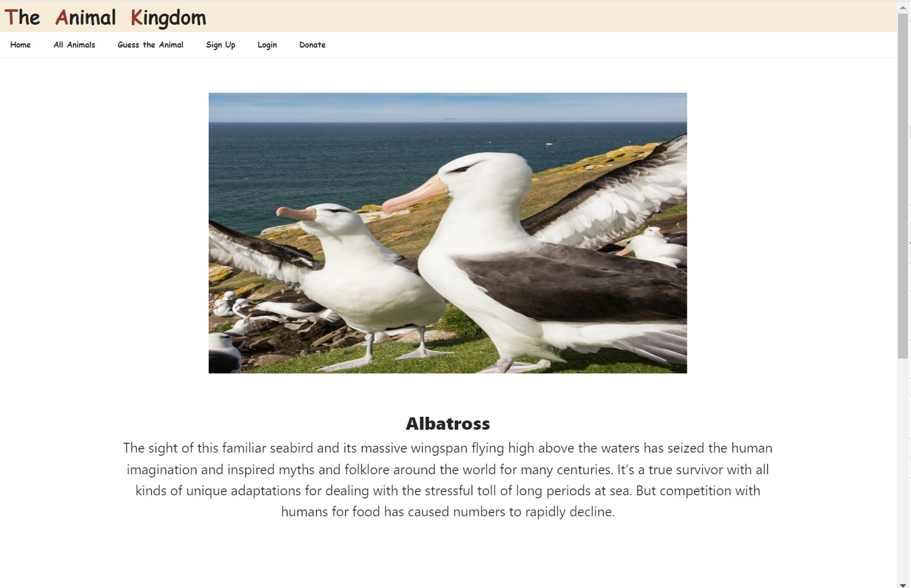
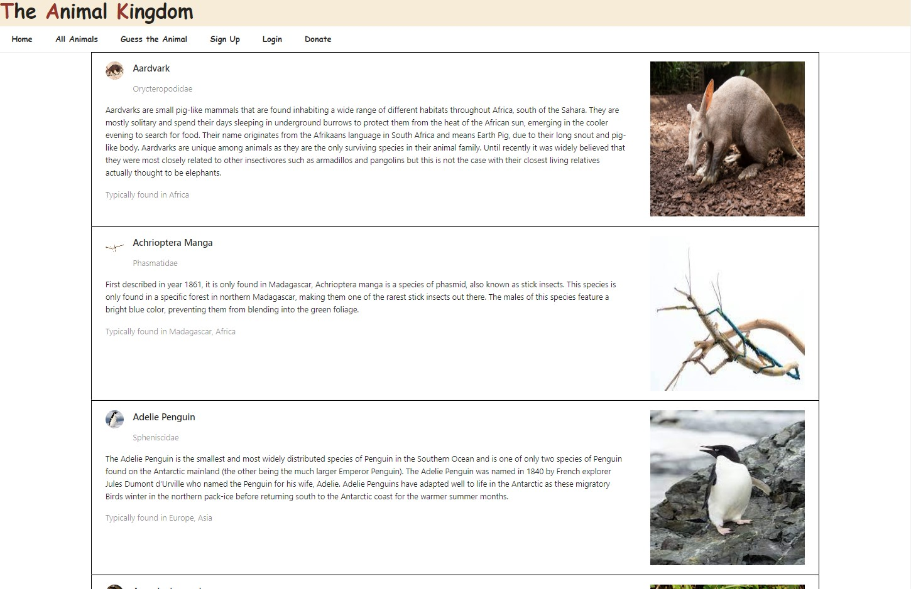
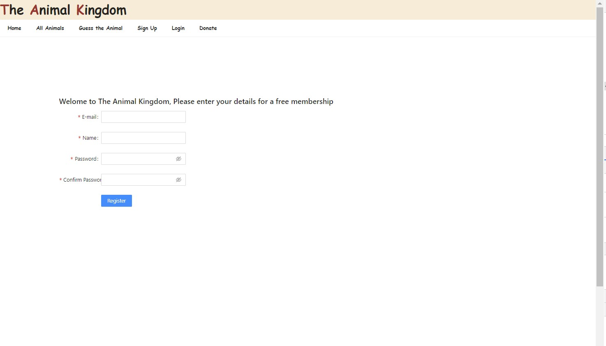
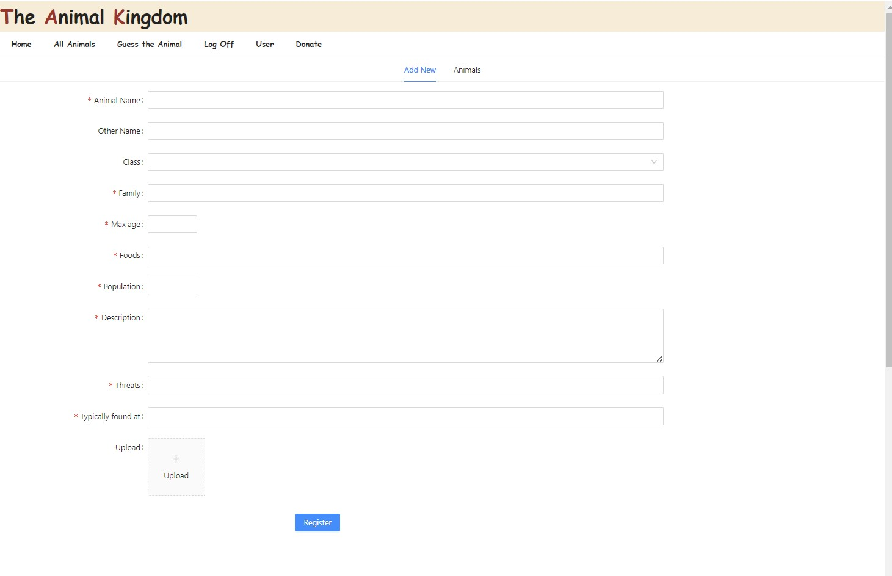
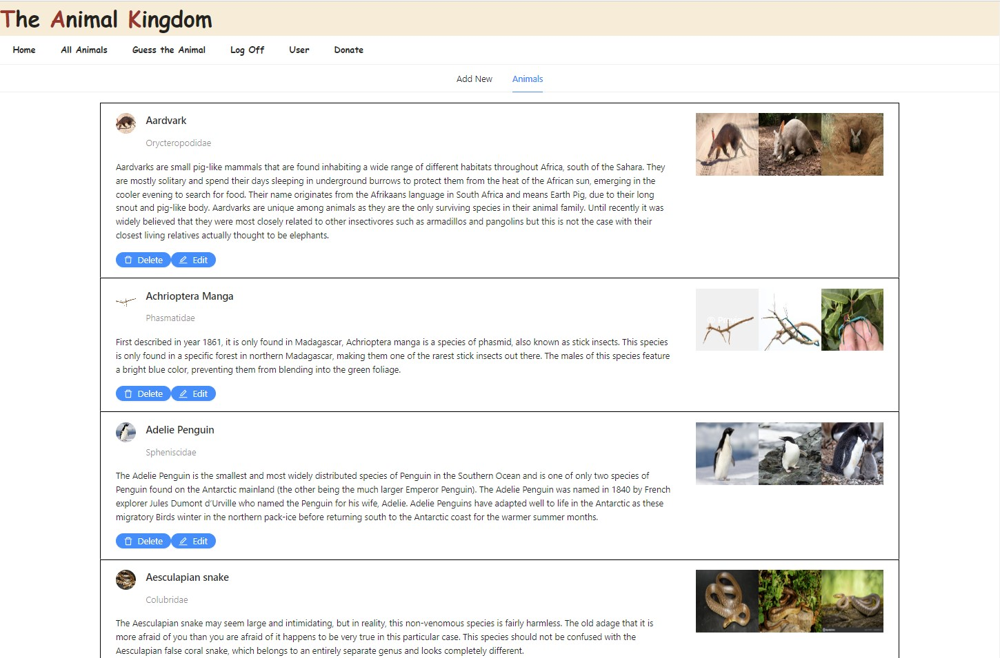

# The_Animal_Kingdom

The project has been developed as a part of learning objective for Animal Life.The Aim is to make it as an single point online resources which interested parties can reference too

# Table of Contents
1. [Description](#Description)
2. [Get_Started](#Get_Started)
3. [Using_the_Application](#Using_the_Application)
4. [Images](#Images)
5. [Techonology](#Techonology)
6. [Issues_Facing](#Issues_In Functionality)
7. [Questions](#Questions)

## Description 
This web-application built as Wildlife learning platform which can be referenced for inforamtion for any particular animal.

## Get Started
you will need to clone repository from https://github.com/Anu-Saini/the_animal_kingdom.git

The project depandencies can be downloaded via npm package manager using ```npm install``` command.

We have to created a database 'animal-database' in 'MongoDB' by creating an account on MongoDB.

Once the database is created, we need to create collections and feed in initial data by  running the ```npm   run seed``` script.

Once the collections are in place, we need to populate the database by seeding the tables with data by running the script seeds using terminal as advised above

We connect to the server via dotenv.

## Using the Application
The application has been developed with help of both front end and back end code using MERN techonology and tools. The front end has been developed using REACT.js while the back end is supoorted by Node and express.js.


## Images/Assets
The following images will depict the functionality of the web applicaton

### Home Page


### All Animals


### Signup Page


### Adding Animals


### user Dashboard



## Techonology
The application has been built using the following techonologies and tools
React.js, Ant Design, Custom CSS<br> 
Node.js, Express.js, JWT, Stripe<br>
Mongoose ,  MongoDB, Mongo Atlas, Azure Storage Blobs

## Issues_In Functionality
Due to time constraint , the following features are not functional at the moment. I am still working on the same.

 ### Deployment of Application on Heroku.com 
 the application fails to be deployed on the heroku page. It given an application error, despite building correctly.

 ### Payment Functionality 
 the application only has the front end Donation features, however the back end and supported functionality has not been added due to time constraints.
 
 ### New User Added Animals display 
 on Being active,the user is able to add new animals to the database as well as add images to Azure blobs. Once added, the new animals is not being displayed in users account due to some issue in displaying/styling.  
 The addition of Animals can be verified by looking for the added Animal in all Animals.  
  

### Application  
The application has been hoisted on cloud by using a cloud service platform called Heroku. The link to the application is: https://wildlifeproject.herokuapp.com/


## Collaborators
This project is copyright @2022 AnuraagSaini and has been developed as a part of Solo Project for the BootCamp Spot Course by <br>
Anuraag Saini 

## Question / inquireies / suggestions 
For questions can be directed to us at the below addresses:
github Username: Anu-Saini   <br>  
email: saini.anuraag@gmail.com

